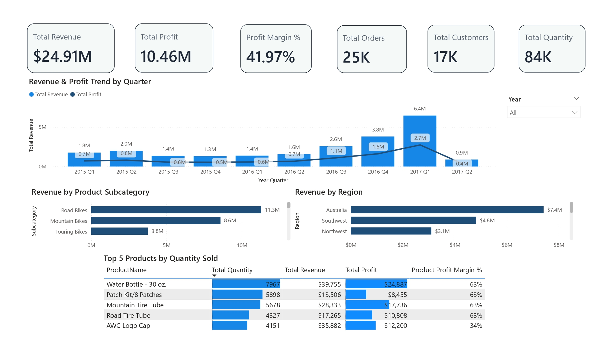
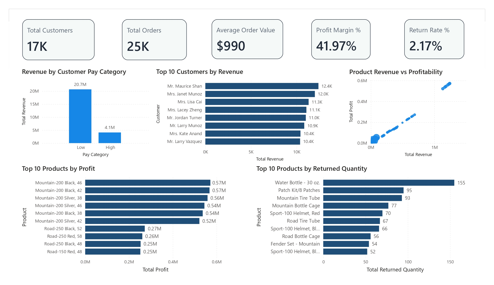

# Sales & Business Performance Analysis — Power BI

## 📊 Project Overview

An independent Power BI project developed to analyse sales performance, profitability, customers, products, regions, and returns using the AdventureWorks dataset.

The project focuses on transforming raw business data into interactive dashboards and actionable business insights.

---

## 🎯 Project Objectives

The main objectives of this project were to:

- Analyse overall sales and profit performance
- Track revenue and profit trends over time
- Identify high-performing product categories and subcategories
- Analyse regional sales performance
- Understand customer revenue contribution
- Compare product revenue and profitability
- Analyse product return patterns
- Develop interactive dashboards for business reporting

---

## 🛠️ Tools & Technologies

- **Power BI**
- **Power Query**
- **DAX**
- **Data Modelling**
- **Microsoft Excel**

---

## 🔄 Project Workflow

**Raw Data → Data Preparation → Data Modelling → DAX Measures → Dashboard Development → Business Insights**

### 1. Data Preparation
- Combined sales data from multiple years
- Cleaned and transformed datasets using Power Query
- Checked data quality and consistency
- Prepared datasets for analysis

### 2. Data Modelling
- Built relationships between sales, customers, products, territories, returns and calendar data
- Created a structured data model for reporting

### 3. DAX & KPI Development
Developed measures to calculate key business metrics including:

- Total Revenue
- Total Profit
- Profit Margin
- Total Orders
- Total Customers
- Total Quantity
- Average Order Value
- Return Rate

### 4. Dashboard Development
Created interactive dashboards to explore business performance from different perspectives.

---

## 📈 Dashboard 1 — Business Performance

The first dashboard provides an overview of overall business performance.

### Key Metrics

| KPI | Value |
|---|---:|
| Total Revenue | $24.91M |
| Total Profit | $10.46M |
| Profit Margin | 41.97% |
| Total Orders | 25K |
| Total Customers | 17K |
| Total Quantity | 84K |

### Key Analysis

- Revenue and profit trends across quarters
- Revenue by product subcategory
- Revenue by region
- Top products by quantity sold
- Product revenue and profitability performance

### Key Insights

- **Road Bikes** generated the highest revenue among product subcategories at approximately **$11.3M**.
- **Australia** recorded the highest regional revenue at approximately **$7.4M**.
- **2017 Q1** was the strongest quarter shown, generating approximately **$6.4M revenue** and **$2.7M profit**.

---

## 👥 Dashboard 2 — Customer & Product Analytics

The second dashboard focuses on customers, products, profitability and returns.

### Key Analysis

- Customer revenue contribution
- Top 10 customers by revenue
- Product revenue versus profitability
- Top products by profit
- Top products by returned quantity
- Return rate analysis

### Key Insight

Customers in the **Low Pay Category** contributed approximately **$20.7M** in revenue compared with approximately **$4.1M** from the High Pay Category.

The product profitability analysis also helped identify products generating strong revenue and profit, while return analysis highlighted products with higher returned quantities.

---

## 📊 Key Business Questions

This dashboard was designed to answer questions such as:

- How much revenue and profit are we generating?
- Which products and subcategories perform best?
- Which regions generate the most revenue?
- Which customers contribute the most revenue?
- Which products generate the highest profit?
- Which products have higher return quantities?
- How does profitability change over time?

---

## 💡 Key Learning

This project helped strengthen my practical skills in:

- Data cleaning and transformation
- Data modelling
- DAX calculations
- Interactive dashboard development
- Data validation
- Business-focused data analysis
- Communicating insights through visualisation

A key learning was that effective dashboards depend not only on visual design, but also on reliable data, relationships and calculations.

---
---

## 📸 Dashboard Preview

### Dashboard 1 — Business Performance



### Dashboard 2 — Customer & Product Analytics


## 📁 Project Structure

```text
PowerBI-Sales-Business-Performance-Analysis/
│
├── README.md
│
├── Dashboard/
│   └── Sales_Business_Performance.pbix
│
├── Screenshots/
│   ├── Dashboard_1_Business_Performance.png
│   └── Dashboard_2_Customer_Product_Analytics.png
│
└── Presentation/
    └── PowerBI_Project_Presentation.pptx
